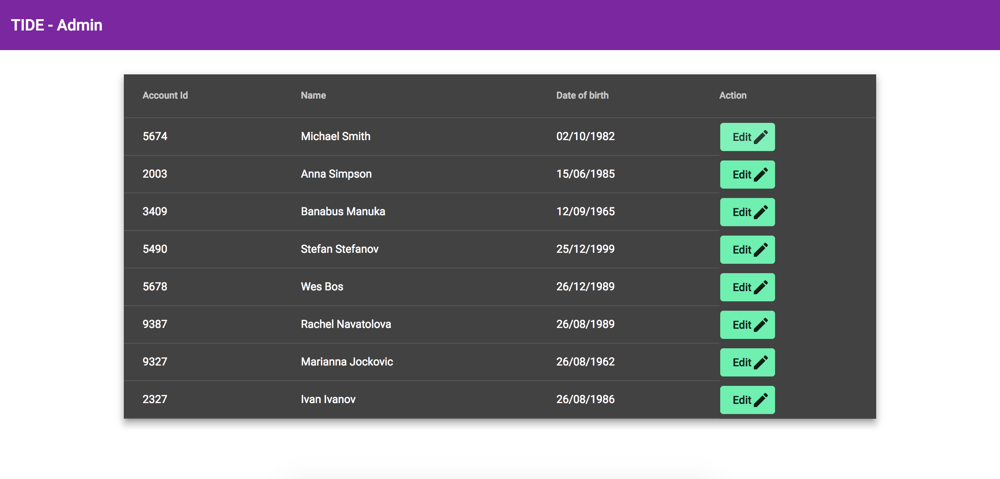
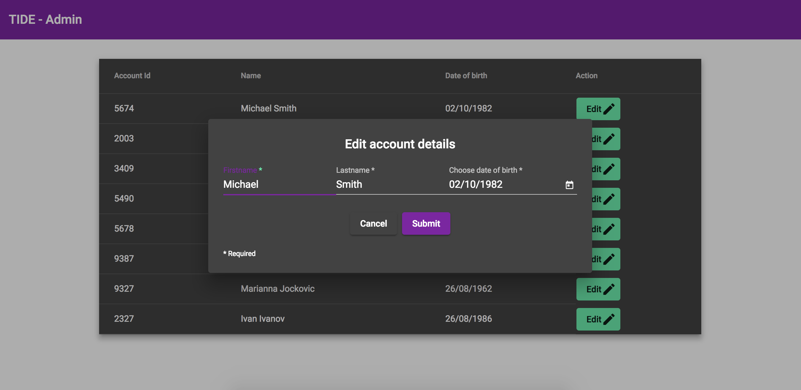
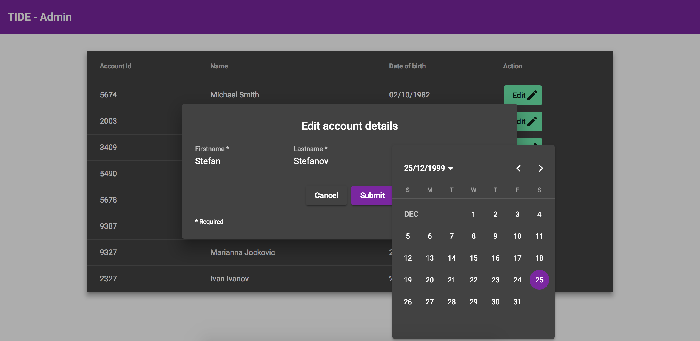
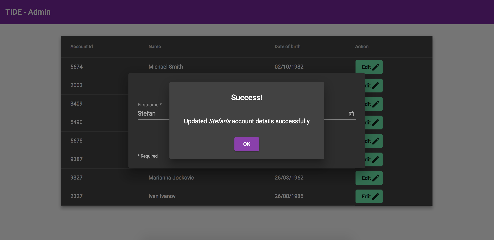

# Tide Accounts Admin panel

This project was generated with [Angular CLI](https://github.com/angular/angular-cli) version 8.x.x.

## Install

-   clone repo `git clone https://github.com/smartsdesign/sm-tide-panel.git`
-   `cd` into directory.
-   run `npm install`

## Development server

Run `npm start` for a dev server. The app will automatically open in the browser, and reload if you change any of the source files.

## REST and API Services

There are two services;

-   Single REST API service `src/app/services/api.service.ts` for the application.
-   Accounts service `src/app/services/accounts.service.ts` to `GET` and `PUT` accounts.

## MOCK data

-   Although the services are available and hooked up to the components, since we don't have the data source, I have created a local data source for the accounts `src/app/data/accounts.ts` that can be readily swapped out for the real API services.

## Screenshots

### Admin panel

### Edit modal and form

### Edit date

### Success message

